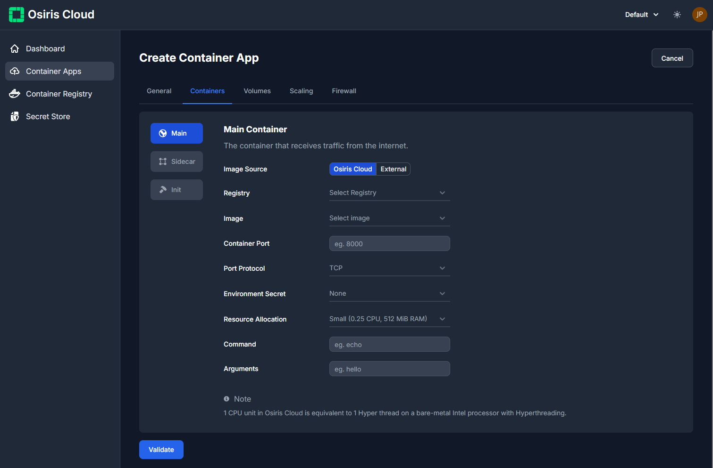
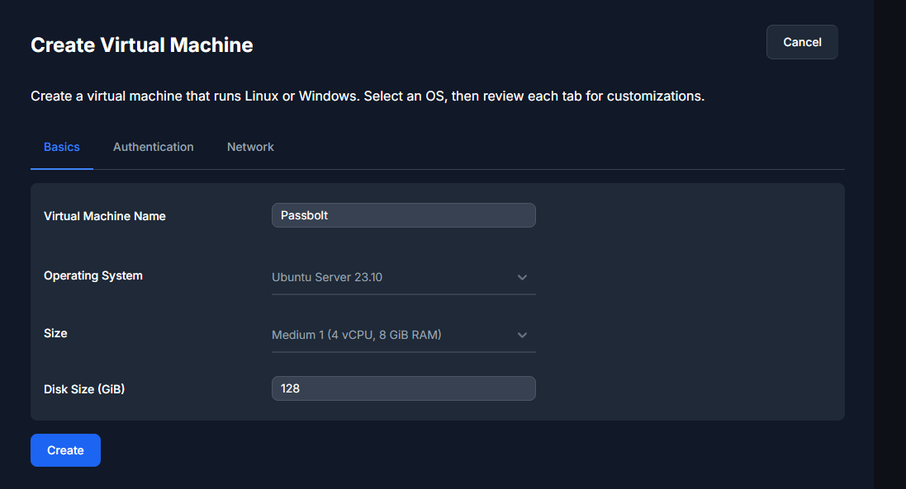
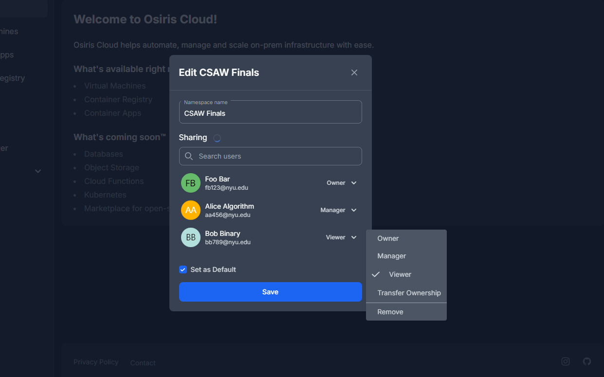

  
  <h1>Osiris Cloud</h1>
  <h2>Open Source, Self-Hosted Cloud</h2>

## What is this project?

Osiris Cloud is a cloud platform built on top of kubernetes designed to eliminate infrastructure barriers -
providing a fast and reliable environment to get stuff done, anywhere from hobby projects to deploying production
applications. Osiris Cloud aims to give developers the tools to push boundaries, accelerate ideas, and transform
what's possible. It is designed to turn your bare metal hardware into a powerful cloud platform.

> [!NOTE]
> The project is in its early days and is not yet ready for production use.

## Container Apps

Containers can be deployed as main, init and/or sidecar containers. All containers are run isolated on the kernel level
using lightweight virtual machines.

## Virtual Machines

VM's can be easily created by using the web interface. It takes in username, password, SSH key etc. and provisions the
resource without waiting for you to go through the traditionally long setup process

## Other Features

- Container Registry
- Secret Store
- DNS Manager (planned)
- Object Storage (planned)

## Namespaces

Namespaces are used to isolate resources and provide a way to manage access control. This lets you have multiple users
on your cloud platform, each with their own isolated environment. 

## Infrastructure Dependencies

- [Kubernetes](https://kubernetes.io/)
- [Kata Containers](https://katacontainers.io/)
- [Containerd](https://containerd.io/)
- [Traefik](https://traefik.io/)
- [Ceph](https://ceph.io/)
- [Prometheus](https://prometheus.io/)
- [Elasticsearch](https://www.elastic.co/)
- [KubeVirt](https://kubevirt.io/)
- [Distribution](https://github.com/distribution/distribution)
